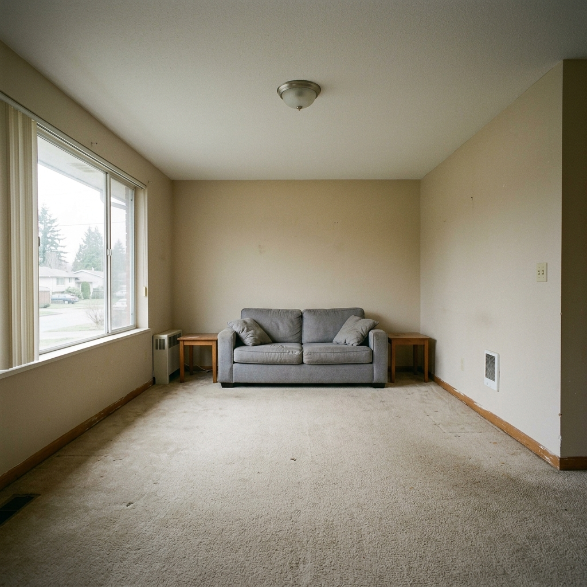

# 🏛️ VIBE SPACIEE

> An AI-powered interior design assistant that transforms your room photos into styled architectural renders using **Google Gemini Vision** and **Imagen 3.0**.

**Live Demo:** [Pending Google Cloud Deployment](#)

**Local Access:** [http://127.0.0.1:8001/](http://127.0.0.1:8001/) *(Note: You must start the local server first)*



---

## ✨ Features

- 📸 **Room Validation** — Gemini 1.5 Flash vision model rejects non-room images (selfies, landscapes, etc.) before processing
- 🤖 **AI Design Generation** — Imagen 3.0 generates two photorealistic interior design options in the *Aethelred Slate & Terracotta* style
- 💰 **Budget Estimator** — Itemized furniture recommendations scaled to your budget in INR / USD / GBP
- 🎨 **Before / After View** — Side-by-side comparison of your original room vs. the AI-engineered render
- ⚡ **Async Pipeline** — Non-blocking background generation with real-time polling

---

## 👥 Target Audience

The system is designed to accommodate 3 primary user archetypes:
- 🏡 **Homeowners / DIY Decorators**: Users with little to no professional design experience needing an intuitive UI, clear visual outputs, and budget estimations.
- 📐 **Freelance Interior Designers**: Professionals seeking an AI-assisted tool for rapid prototyping, high-fidelity aesthetic mapping, and accurate cost estimations.
- 🛋️ **Furniture Vendors (Future Scope)**: Localised vendors who may interface with the platform to supply recommended furniture matching AI-generated designs.

---

## 🛠️ Tech Stack

| Layer | Technology |
|---|---|
| Frontend | HTML5, Vanilla CSS, Vanilla JavaScript |
| Backend | Python, FastAPI, Uvicorn |
| AI — Vision | Google Gemini 1.5 Flash |
| AI — Image Gen | Google Imagen 3.0 |
| Image Processing | Pillow (PIL) |
| Computer Vision | YOLOv8 (simulated pipeline) |
| Fonts | Playfair Display, Inter (Google Fonts) |

---

## 🚀 Getting Started (Local)

### Prerequisites
- Python 3.9+
- A [Google AI Studio API key](https://aistudio.google.com/app/apikey)

### 1. Clone the repo
```bash
git clone https://github.com/nuhita-netizen/room-organizer.git
cd room-organizer
```

### 2. Set up the backend
```bash
cd backend
python -m venv .venv

# Windows
.venv\Scripts\activate

# macOS / Linux
source .venv/bin/activate

pip install -r requirements.txt
```

### 3. Configure environment variables
```bash
# Copy the example file
cp .env.example .env
```

Edit `backend/.env` and add your Google API key:
```
GOOGLE_API_KEY=your_google_api_key_here
```

### 4. Run the app

**Option A — one-click (Windows only):**
Double-click `start.bat` in the project root.

**Option B — terminal:**
```bash
cd backend
.venv\Scripts\uvicorn app.main:app --host 127.0.0.1 --port 8001 --reload
```

### 5. Open the app
Navigate to **http://127.0.0.1:8001** in your browser.

---

## 📁 Project Structure

```
room-organizer/
├── demo.html                  ← Frontend source (single file)
├── start.bat                  ← One-click Windows startup script
├── backend/
│   ├── app/
│   │   ├── main.py            ← FastAPI application entry point
│   │   ├── api/
│   │   │   └── endpoints.py   ← All API route handlers
│   │   └── models/
│   │       └── schemas.py     ← Pydantic request/response models
│   ├── static/
│   │   ├── index.html         ← Served frontend (synced from demo.html)
│   │   ├── generic_room.png   ← Fallback room image
│   │   └── results/
│   │       ├── mock_opt1.png  ← Fallback design render (Option 1)
│   │       └── mock_opt2.png  ← Fallback design render (Option 2)
│   ├── requirements.txt
│   └── .env.example           ← Environment variable template
└── .gitignore
```

---

## 🔌 API Reference

| Method | Endpoint | Description |
|---|---|---|
| `GET` | `/` | Serves the frontend |
| `POST` | `/api/v1/upload` | Upload a room image |
| `POST` | `/api/v1/validate-room` | AI room detection (Gemini Vision) |
| `POST` | `/api/v1/generate` | Start design generation |
| `GET` | `/api/v1/generations/{id}` | Poll generation status |
| `GET` | `/docs` | Swagger UI (auto-generated) |

---

## 🎨 Design Theme — Aethelred Slate & Terracotta

The app ships with a single opinionated design theme:
- **Deep Slate** (`#0f172a`) — architectural backdrop
- **Terracotta** (`#c25c42`) — warm, earthy accent
- **Typography** — Playfair Display (headings) + Inter (body)

---

## ⚠️ Notes

- The **YOLOv8 segmentation** step is currently simulated (1-second delay + console logs). The `torch` dependency is included for a future real integration with the `ultralytics` library.
- When the Imagen 3.0 API quota is exceeded or unavailable, the app automatically falls back to pre-generated mock renders (`mock_opt1.png`, `mock_opt2.png`).
- The `GOOGLE_API_KEY` must be set in `backend/.env` — never commit the actual key.

---

## 📄 License

MIT License — free to use, modify, and distribute.
