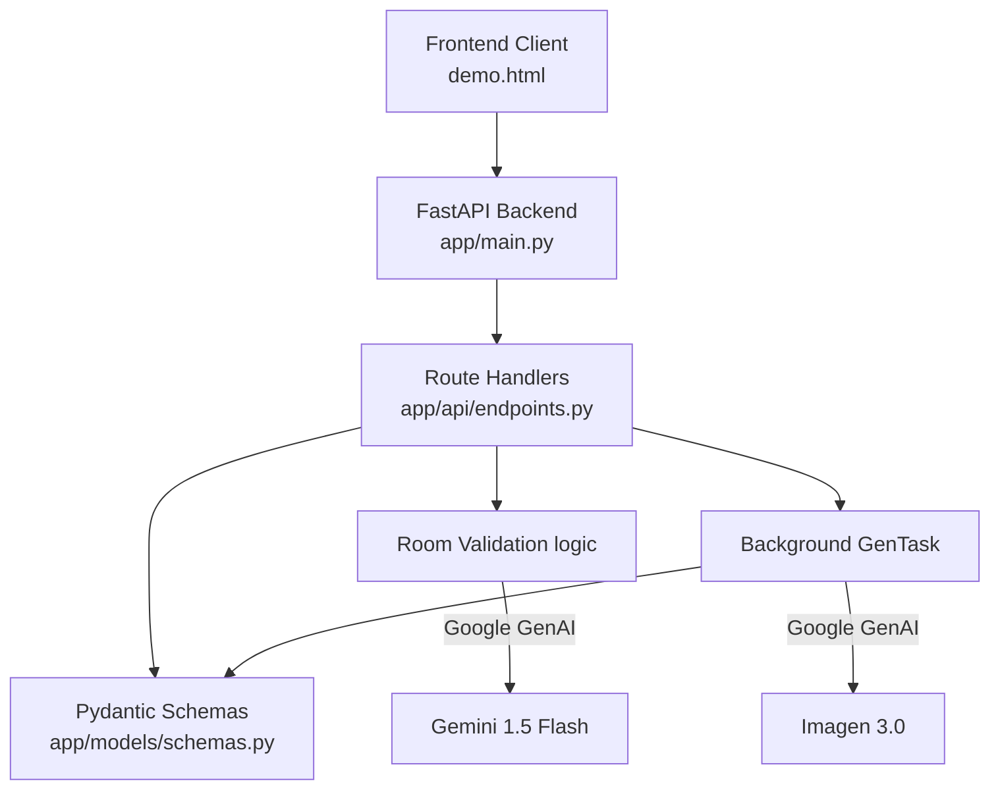
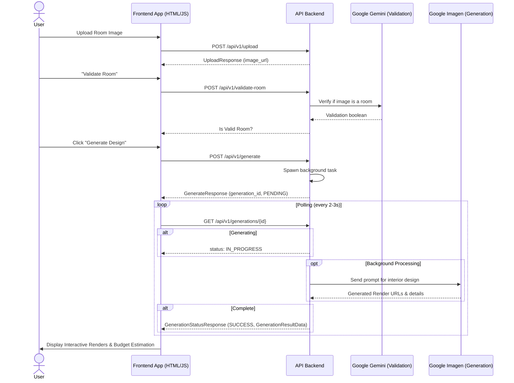
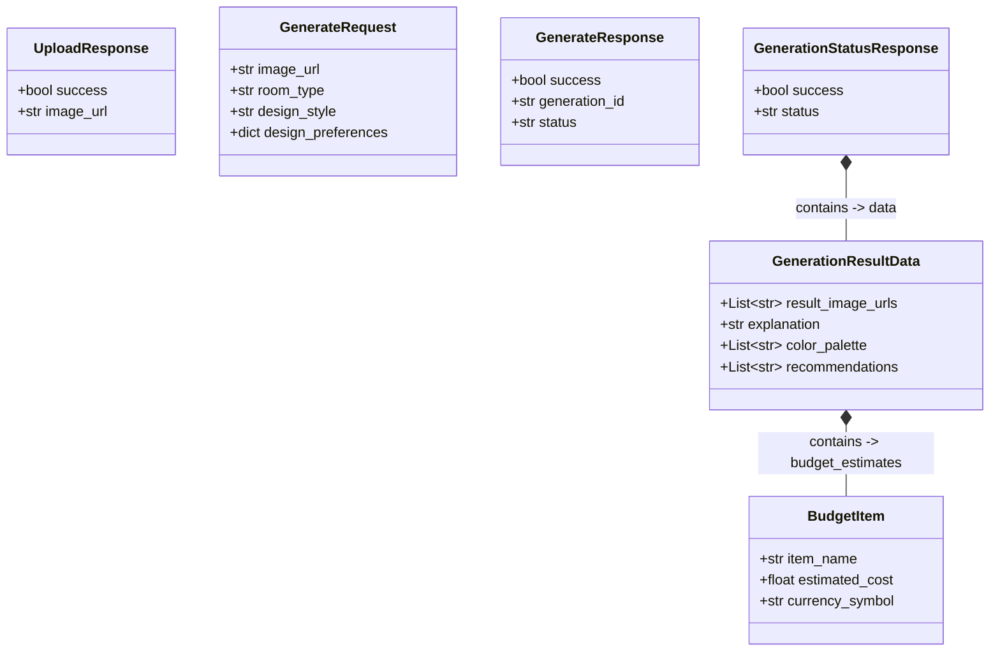

# Archi RoomAI - UML Diagrams

This document outlines the architecture, data models, and sequence workflows of the **Archi RoomAI** application using Mermaid UML.

## 1. Component Architecture
This diagram shows the high-level system architecture and how different components interact.

## 2. Sequence Workflow (Main Application Flow)
This sequence diagram models the lifecycle of a user uploading an image, the system validating it, and asynchronously generating design styles.

## 3. Class Diagram (Data Transfer Objects)
This class diagram illustrates the Pydantic schemas used for API requests and responses.

